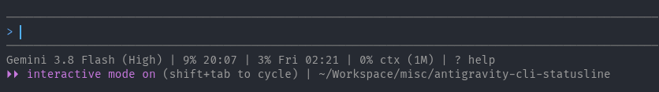
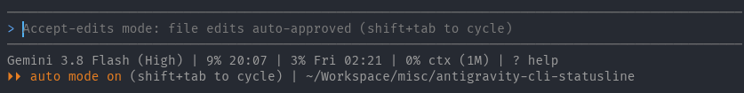
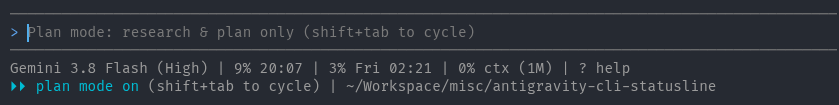

# Antigravity CLI statusline

A two-row statusline for the Antigravity CLI (`agy`) that displays active model details, quota consumption, context window usage, agent cycle mode, and current workspace directory.

## Screenshots







- **Primary row**:
  + **Model**: Active model display name (e.g., `Gemini 3.8 Flash (High)`).
  + **5-hour quota**: Used percentage and next reset time (`HH:MM`).
  + **Weekly quota**: Used percentage and next reset day/time (`Ddd HH:MM`, e.g., `Fri 02:21`).
  + **Context window**: Used percentage and total context capacity (e.g., `0% ctx (1M)`).
  + **Help indicator**: Keyboard shortcut reminder (`? help`).
- **Secondary row**:
  + **Cycle mode**: Current execution mode (`interactive mode on`, `auto mode on`, or `plan mode on`).
  + **Cycle hotkey**: Key combination to switch modes (`shift+tab to cycle`).
  + **Working directory**: Current workspace path, shortened with `~` when inside user home.

## Prerequisites

- [Node.js](https://nodejs.org) (v16 or newer)
- Antigravity CLI (`agy`)

## Installation

### Automated installation

Run the installer matching your operating system from this repository directory:

#### Linux and macOS

```bash
./install.sh
```

Alternatively, run the cross-platform Node installer directly:

```bash
node install.js
```

#### Windows

Run in PowerShell:

```powershell
.\install.ps1
```

Alternatively, run in PowerShell or Command Prompt:

```bash
node install.js
```

The installer performs two actions automatically:

1. Copies `statusline.js` into your user configuration folder (`~/.gemini/antigravity-cli/` on Linux/macOS or `%USERPROFILE%\.gemini\antigravity-cli\` on Windows).
2. Configures or merges the `statusLine` command into `settings.json`.

### Manual installation

If you prefer manual setup:

1. Copy `statusline.js` into your Antigravity CLI directory:
   + Linux and macOS: `~/.gemini/antigravity-cli/statusline.js`
   + Windows: `%USERPROFILE%\.gemini\antigravity-cli\statusline.js`

2. Make the file executable on Unix systems:

   ```bash
   chmod +x ~/.gemini/antigravity-cli/statusline.js
   ```

3. Open your Antigravity settings file:
   + Linux and macOS: `~/.gemini/antigravity-cli/settings.json`
   + Windows: `%USERPROFILE%\.gemini\antigravity-cli\settings.json`

4. Add or update the `statusLine` configuration block:

   ```json
   {
     "statusLine": {
       "type": "command",
       "command": "node -e \"require(require('path').join(require('os').homedir(), '.gemini', 'antigravity-cli', 'statusline.js'))\"",
       "enabled": true
     }
   }
   ```

## How it works

The Antigravity CLI streams session telemetry as JSON through standard input whenever prompt or execution state changes. The `statusline.js` script processes this payload, formats ANSI-colored text for each segment, and emits two lines:

- Primary status line with model and quota statistics.
- Secondary status line with agent mode and working directory.

For troubleshooting or inspecting raw telemetry data, `statusline.js` also writes the latest JSON payload to `.statusline-last.json` in the configuration folder.
